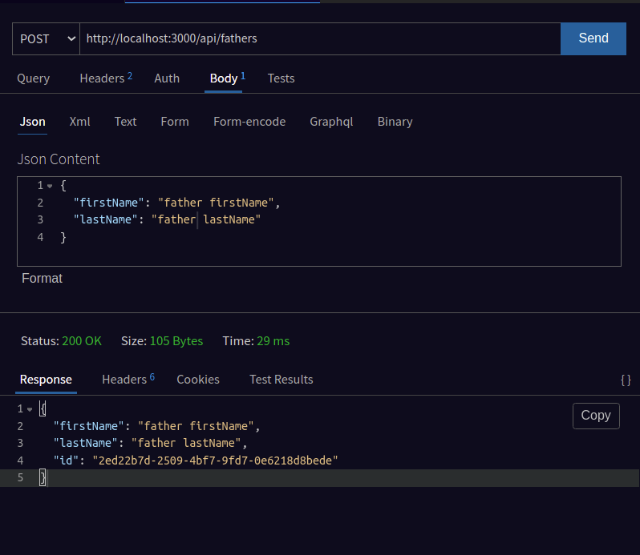
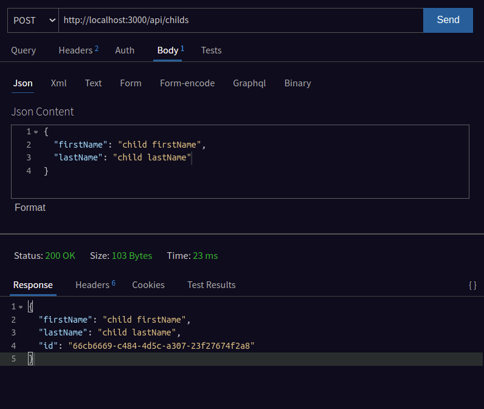
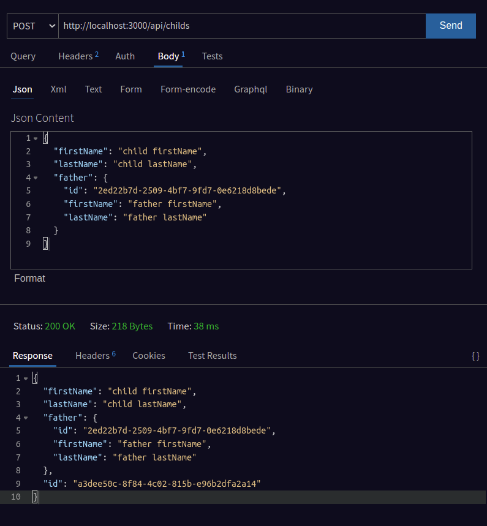

# **ExpressJS TypeORM example**
**I am learning NodeJS and external libraries. I tried TypeORM, MySQL and Express JS in this repository.**

---
## **Models**
- ### Children
- ### Father

---

##  **APIs, Requests and Responses**

### **_Fathers endpoint req and res_**

### **_Childs endpoint req and res_**

## **_It's ok but how to add child and father?_**

---

### This project was created by [NizSimsek](https://www.instagram.com/ilahinizo/)
